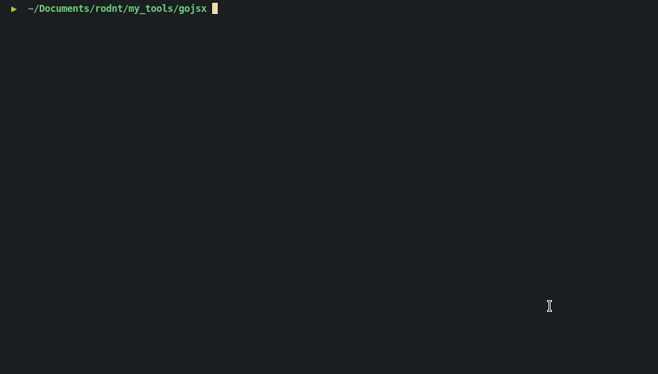

#### Features
    - Search for javascript inside domain and grep
        - js with relative paths like ( ./foo.js, /foo2.js, //foo3.js, https://another.domain/foo4.js)
        - js inside <script> tags without src=
        - Regex like firebase and patterns like apis and tokens
#### Usage
  - go run main.go -url https://domain.com

#### Requirements
    - Golang >= 1.16
    - Yaml config file ( see regexs_sample.yaml)

### TODO
    - Sessions ( authenticated pages)
    - Concurrency
    - multiple URLs ( scan many URLs from stdin )
    - Scan from burp ( Extract all scripts from BURP and parse them  )
    - Tunning regex

#### Running

